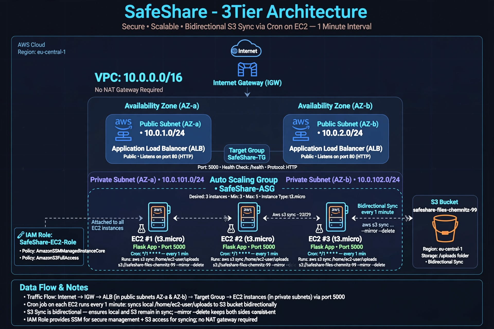

# SafeShare - 3Tier Architecture

**Secure • Scalable • Bidirectional S3 Sync via Cron (1 min)**

## Architecture Diagram

```mermaid
flowchart TB
    User([User / Browser]) --> Internet((Internet))
    Internet --> IGW[Internet Gateway - IGW]
    IGW --> ALB[Application Load Balancer<br/>Public Subnets<br/>10.0.1.0/24 | 10.0.2.0/24<br/>Port 80/443]

    ALB --> TG[Target Group: SafeShare-TG<br/>Port 5000 / Health: /health]

    TG --> ASG[Auto Scaling Group<br/>Min 3 / Desired 3 / Max 6<br/>t3.micro - Amazon Linux 2023]

    subgraph Private Subnets
        ASG --> EC2A[EC2 #1 - t3.micro<br/>AZ-a - 10.0.101.0/24<br/>Flask :5000<br/>Cron: * * * * *]
        ASG --> EC2B[EC2 #2 - t3.micro<br/>AZ-b - 10.0.102.0/24<br/>Flask :5000<br/>Cron: * * * * *]
        ASG --> EC2C[EC2 #3 - t3.micro<br/>AZ-a<br/>Flask :5000<br/>Cron: * * * * *]
    end

    EC2A <-->|aws s3 sync --delete<br/>bidirectional every 1min| S3[(S3 Bucket<br/>safeshare-files-99<br/>/home/ec2-user/uploads)]
    EC2B <-->|aws s3 sync --delete<br/>bidirectional| S3
    EC2C <-->|aws s3 sync --delete<br/>bidirectional| S3

    IAM[IAM Role: SafeShare-EC2-Role<br/>SSM + S3 Policy] -.-> EC2A
    IAM -.-> EC2B
    IAM -.-> EC2C
```

## Visual Diagram



## Data Flow
```
User Upload
  → Internet → IGW → ALB (Public Subnets)
  → Target Group :5000
  → EC2 (Private, Flask) → /home/ec2-user/uploads/
  → Cron Job every 1 min → S3 Sync → Replicated to all EC2s
```

## Components

### 1. Network
- VPC 10.0.0.0/16
- 2 Public Subnets (ALB) - 10.0.1.0/24, 10.0.2.0/24
- 2 Private Subnets (EC2) - 10.0.101.0/24, 10.0.102.0/24

### 2. Load Balancing
- ALB Public, Listener 80/443 → Target Group Port 5000
- Health Check: /health

### 3. Compute
- Launch Template: t3.micro, AL2023, cronie installed
- User Data installs Flask, creates /uploads, sets crontab
- ASG self-healing

### 4. Storage
- S3 Bucket: safeshare-files-99
- Central persistent storage for uploads

### 5. S3 Sync Script
```bash
#!/bin/bash
BUCKET="safeshare-files-99"
DIR="/home/ec2-user/uploads"
LOG="/var/log/s3-sync.log"
/usr/bin/aws s3 sync $DIR s3://$BUCKET/ --delete >> $LOG 2>&1
/usr/bin/aws s3 sync s3://$BUCKET/ $DIR >> $LOG 2>&1
chmod -R 777 $DIR
chown -R ec2-user:ec2-user $DIR
```

## Key Points
- HA across 2 AZs
- Private EC2, no public IP, SSM management
- Bidirectional sync ensures all instances see same files
- Survives instance replacement via S3
